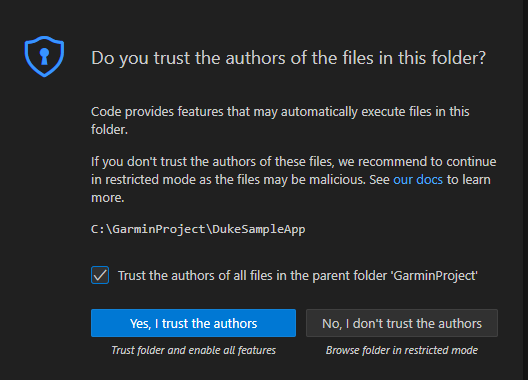
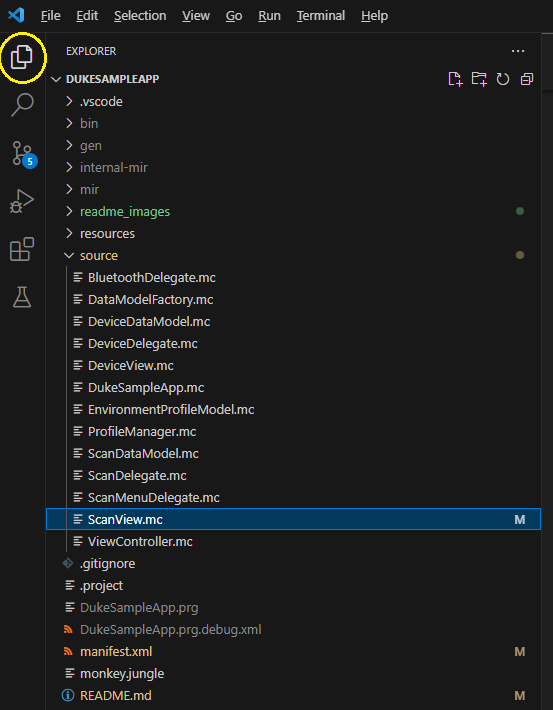
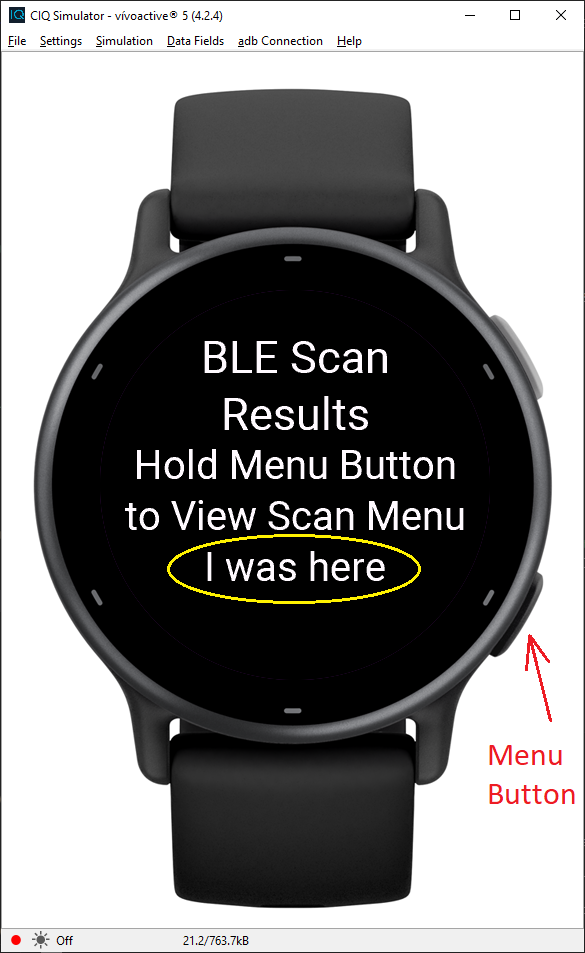
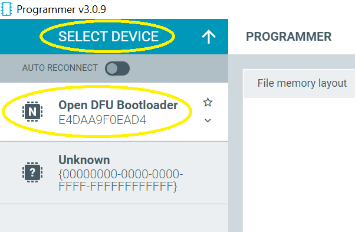
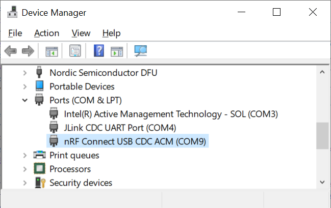
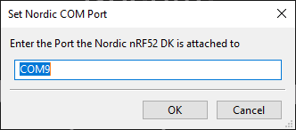
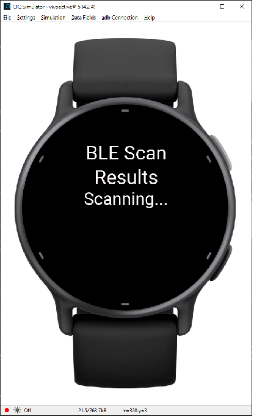
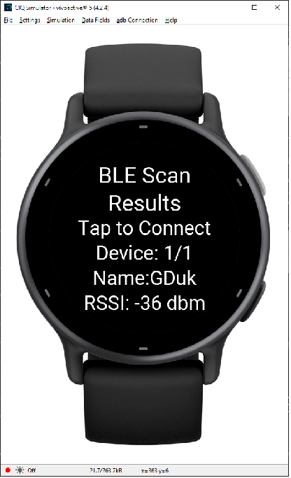
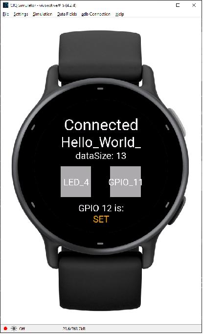
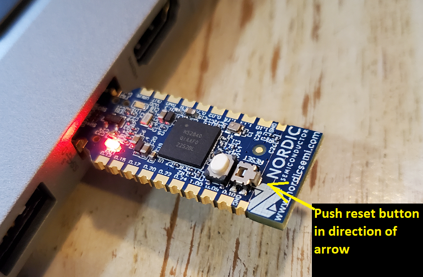

# Duke Project Example - Connect IQ App
This guide will assist you in getting started with development of a Connect IQ (CIQ) application that uses Bluetooth to 
communication with an external accessory. In the example, bi-directional communication is established between 
a [Garmin vívoactive 5 smartwatch](https://www.garmin.com/en-US/p/1057989/pn/010-02862-10) and an accessory 
([nRF52 DK](https://www.nordicsemi.com/Products/Development-hardware/nRF52-DK)). The guide also explains how to setup 
your CIQ development environment and enable the Bluetooth functionality within the CIQ device simulator.

> [!WARNING]
> Be sure to complete the [nRF_CustomBleProfile guide](https://github.com/4djelliot/nRF_CustomBleProfile) prior to cloning
this repo, since we recommend cloning this repo into a new _DukeSampleApp_ folder in your Connect IQ SDK's _samples_ folder.

# Step 1: Gather, Install, and Setup System Requirements
## Hardware
In addition to the [hardware list](https://github.com/4djelliot/nRF_CustomBleProfile?tab=readme-ov-file#hardware) in the 
nRF_CustomBleProfile guide you will need: 
* [Garmin vívoactive 5 smartwatch](https://www.garmin.com/en-US/p/1057989/pn/010-02862-10) or another compatible smartwatch.
* [Garmin USB-A Charging/Data Cable](https://www.garmin.com/en-US/p/696132/pn/010-12983-00)
* [nRF52840 USB Dongle](https://www.nordicsemi.com/Products/Development-hardware/nRF52840-Dongle)
    * Used to enable Bluetooth connectivity for the Connect IQ device simulator
* nRF52 DK that has been flashed with firmware from the [nRF_CustomBleProfile project](https://github.com/4djelliot/nRF_CustomBleProfile).
* Computer (Windows 10 / Windows 11 were used in our demo)

## Computer Software
### Warnings Before Installing Software
* Install each piece of software in the order listed below for ease of install. 
* For each piece of software, carefully read any notes prior to beginning install: they include 
important info, tips, and steps that may need to be skipped!
### Install Software


1. **Java 1.8.0**
    * Oracle Java&trade; Runtime Environment 8 (version 1.8.0 or higher) is required.
    * **Download link**: http://java.com/en/download/
1. **Create a Garmin Connect Account**
    * You will need credentials from a Garmin Connect Account in order to setup the CIQ SDK in the next step. 
	You can use an existing account or create one for free. Additional sign in help is 
	available [here](https://support.garmin.com/en-US/?faq=v2sFtNt5j9AcJJy3Cvpon6).
    * **Connect Sign In**: https://connect.garmin.com/signin
1. **Garmin Connect IQ SDK**
    * The SDK Manager allows you to download different versions of the CIQ SDK and keep your device library up to date. 
	You can also configure the SDK Manager to automatically download updates when they become available.
	* This example was developed using Connect IQ SDK 6.4.1.
	* Create a <dev_root_folder> on your Windows computer. For example, something like C:\GarminProject\. 
	This <dev_root_folder> will be referenced several places within these setup instructions.
	* Store the SDK Manager in <dev_root_folder>\connectiq-sdk-manager-windows folder.
	* The SDK Manager will copy SDKs, the device library, sample code and fonts into the following folder on your Windows computer:
    \Users\<username>\AppData\Roaming\Garmin\ConnectIQ\
    * **Download link**: https://developer.garmin.com/connect-iq/sdk/
1. **Visual Studio Code**
    * You will use the Visual Studio Code IDE to write software for the Garmin watch.
    * **Download link**: https://code.visualstudio.com/docs/setup/setup-overview
1. **Monkey C Visual Studio Code Extension**
    * Monkey C is the programming language for CIQ applications. The Monkey C extension adds support for using the Connect IQ SDK, 
	including a syntax highlighting editor, build integration, and integrated debugger. The link below has instructions for 
	installing the extension.
	* More information about the extension is available on the 
	[VisualStudio Marketplace](https://marketplace.visualstudio.com/items?itemName=garmin.monkey-c).
    * **Installation instructions**: https://developer.garmin.com/connect-iq/reference-guides/visual-studio-code-extension/
1. **Generate a CIQ Developer Key**
    * Your developer's key is used to sign CIQ applications. 
	* **IMPORTANT** don't lose your key. instructions
	for generating a key can be found at the bottom of the page linked below.
	* Recommend storing your key in <dev_root_folder>/ciq_developer_key folder for storing your key.
    * **Instructions**: https://developer.garmin.com/connect-iq/connect-iq-basics/getting-started/	
1. **Sample CIQ Application**
    * After creating a <dev_root_folder>\ciq_projects folder. Use the following commands to clone a copy of this repo
	to your computer:
	```
	cd  <dev_root_folder>/ciq_projects 
	git  clone https://github.com/4djelliot/CIQ_CustomBleProfile.git DukeSampleApp
	```	

# Step 2: Build, Install and Run the sample CIQ application
Now that you have the hardware and software assembled, let's walk through the sample CIQ application
in this repo and get it running on a Garmin smartwatch. At the end of these steps you should be able to
toggle on and off an LED on the nRF52-DK board by tapping a button on the smartwatch. The sample uses
Bluetooth for wireless communication.

## Run the sample CIQ application in the simulator
Follow these steps to compile the sample CIQ application and run it in the simulator:

1. Open Visual Studio Code
1. Select "File" -> "Open Folder" and then select the <dev_root_folder>\ciq_projects\DukeSampleApp folder that 
   was created when you cloned this repo to your computer.
1. You may be asked to trust the authors of the code. Answer Yes and also select the option to 
   "Trust the authors of all files in the parent folder".  
   
1. Make a small change to the source code:
    * Click on the folder icon in the upper left hand corner to open the EXPLORER view.
    * Expand the "DUKESAMPLEAPP" and expand "source".
    * Click on "ScanView.mc" to open this Monkey C source code file.
    * Find the line of code that looks like this:
       ```
       subtext = "Hold Menu Button\nto View Scan Menu";
       ```
       and modify it to look like this by adding "\nI was here" to the end of the string.
       ```
       subtext = "Hold Menu Button\nto View Scan Menu\nI was here";
       ```  
	
1. Add **vivoactive5** to the list of products (only needs to be done one time):
    * Summon the command palette with *Ctrl + Shift + P*
    * Type "Products" and select "Monkey C: Edit Products"
    * Make sure "vivoactive5" is selected in the list of products and then click on "OK"
1. Run the application in the simulator:
    * Select "Run" -> "Run Without Debugging" (or press *Ctrl + F5*)
    * Select "vivoactive5" from the list of devices
	* Wait for the CIQ Simulator to open
	* Notice the "I was here" text at the bottom of the screen  
    

## Configure BLE in the Connect IQ Simulator
Connect IQ supports BLE connectivity from within its simulator via a second dev-kit or nRF52840 USB Dongle (dongle). 
This makes debugging much easier than debugging on watch hardware, as it allows you to use breakpoints in your 
Connect IQ code and avoid constantly flashing to hardware. Most of our work was done using the nRF USB Dongle, 
since you can leave the dongle attached to your PC even when re-programming the dev-kit. Follow the instructions 
below to flash the appropriate firmware to the nRF USB Dongle (see the [Connect IQ BLE Developer's Guide](https://developer.garmin.com/connect-iq/core-topics/bluetooth-low-energy/) for more information).

1. Download the [nRF USB Dongle firmware for Connect IQ connectivity](https://developer.garmin.com/downloads/connect-iq/connectivity_1.0.0_usb_with_s132_5.1.0.zip). Extract the hex file from the downloaded zip file.
1. Plug the nRF USB Dongle into your computer. If you have not previously programmed the dongle, it should enter the Bootloader state, indicated by a flashing red LED on the unit. It will not enumerate to a drive on your computer - this is expected.
1. Open nRF Connect for Desktop -> Programmer
   
1. Click on "SELECT DEVICE".
1. Select "Open DFU bootloader" from the dropdown list.  

1. Observe the memory layout for the dongle populate in the right side of the app.

1. Select "Add file" and select the hex file you downloaded in step 1. Observe the memory layout populate in the left side of the app.

1. Select "Write". You should see a pop-up appear to indicate the programming is in process. Once this completes, 
your nRF USB dongle is programmed and ready to communicate. If the dongle does not enumerate or if you see
the message "Failed to detect device after reboot. Timed out after 10 seconds." then follow the [reset instructions](#reset-nrf52840-usb-dongle) 
below before continuing with these instructions.
1. Determine which COM port was assigned to the dongle: 
    * Open the Windows "Device Manager" and expand the "Ports (COM & LPT)" section.
    * Make note of the COM port number of the nRF52 dongle. You will need this to complete the step below.  
    
1. Configure Bluetooth COM port in CIQ Simulator
    * From Visual Studio Code, select "Run" -> "Run Without debugging" -> "vivoactive5" to launch the simulator.
	* From the simulator menu select "Settings" -> "BLE Settings" to open the "Set Nordic COM Port" dialog.
	* Enter the COM port that was assigned to your dongle and click "OK".  
    

## Toggle an nRF52-DK LED from the simulator
Now that Bluetooth has been configured for the simulator, we can control the nRF52 DK using the sample
application while running in the simulator.
1. If the simulator is already running then close it.
1. Power off and then power on the nRF52 DK board. Note that it should already be programmed with the sample program 
   software as described in the [nRF_CustomBleProfile](https://github.com/4djelliot/nRF_CustomBleProfile) project. 
   LED1 should be blinking.
1. From Visual Studio Code select "Run" -> "Run Without Debugging" -> "vivoactive 5" and wait for the simulator to launch.
1. Press and hold the menu button for about 2 seconds by clicking the lower, right-hand button on the image of the watch. Then release.   
   
1. Select the "Start Scaning" menu item by clicking on it.  
   
1. Wait for the "GDuk" device to be found. This might take 15 to 30 seconds. If it takes more than 30 seconds for the
   device to appear then try powering off and on the nRF52-DK board using the power switch.  
   
1. Click on the center of the watch to connect to the "GDuk" device. This might take 15 to 30 seconds. If it takes more 
   than 30 seconds then try powering off and on the nRF52-DK board.
1. After a successful connection you will see "Connected" displayed at the top of the watch face.
   Now you can click on the "LED_4" button to turn the nRF52 LED on and off.
   Note that the "Hello_World" text scrolling across the screen is being transmitted by the nRF52.  
   
1. Select "File" -> "Quit" to close the simulator when you are done.
   

## Run CIQ application on a Garmin smartwatch
The sample application can also be packaged, installed and run on a Garmin smartwatch. Follow these steps to control 
LED4 using the smartwatch.
1. Package the CIQ application using Visual Studio Code:
    * Summon the command palette with *Ctrl + Shift + P*
    * Type "Device" and select "Monkey C: Build for Device"
	* Select **vivoactive5** from the list of products.
	* When prompted to select a folder, choose <dev_root_folder>\ciq_projects\DukeSampleApp\vva5. Create the vva5 folder if necessary.
	* Select the "Debug" option
	* Wait for "BUILD SUCCESSFUL" to be displayed in the "TERMINAL" window
	* Several files should be created in the <dev_root_folder>\ciq_projects\DukeSampleApp\vva5 folder including DukeSampleApp.prg	
1. Install the sample CIQ application on the Garmin smartwatch:
    * Connect the smartwatch to your computer using a USB cable.
	* The smartwatch should enter USB mass stoage mode or MTP mode.
	* Open the Windows File Explorer and look for the Garmin smartwatch ("vivoactive 5")
	* Copy the DukeSampleApp.prg file to the following location:  
	  ```
	  vívoactive 5\Internal Storage\GARMIN\Apps\DukeSampleApp.prg
	  ```
	* Eject the smartwatch or remove the USB cable.
	* The sample CIQ should be installed on the smartwatch
1. Launch the sample CIQ application on a Garmin vívoactive 5 smartwatch:
    * Press and release the button on the upper right-hand side of the watch. This should open the Activities menu.
	* Tap on the "Apps" tab (or swipe left) to display the Apps menu.
	* Scroll through the list and look for "Duke Sample App".
	* Tap on "Duke Sample App" to run the application.
1. Make sure the nRF52-DK board is powered on and ready to go.
    * It should have already been programmed with the sample software as described in the
	[nRF_CustomBleProfile](https://github.com/4djelliot/nRF_CustomBleProfile) project. 
	* LED1 should be blinking.
	* Optionally, power the nRF52-DK board off and back on to make sure it is in a known good state.
1. Establish a Bluetooth connection:
    * Launch the sample CIQ application on the watch.
	* Press and release the button on the lower right-hand side of the watch to display the scan menu.
	* Tap on "Start Scanning".
	* When the nRF52-DK board has been found, the watch will display the name of the device ("GDuk") and the RSSI (signal strength).
	* Tap on the display to connect to the "GDuk" device.
	* The watch should display "Connecting" and then "Connected" when the Bluetooth connection has been established.
1. Toggle LED4 on and off:
	* Tap on the "LED_4" button on the watch.
	* Notice that LED4 on the nRF52-DK board will turn off and on.	

# Troubleshooting
## Visual Studio Code Extension
### Errors executing Monkey C Commands
Once you open the CIQ project in Studio Code, you may encounter errors when trying to execute Monkey C commands such as:
```
Workspace not found.
Connect IQ project not found. Be sure your project has a monkey.jungle file and the project's Jungle Files setting is correct.
```

If so, use **File** -> **Add Folder** to Workspace and select the _DukeSampleApp_ folder.
Reference: https://forums.garmin.com/developer/connect-iq/f/discussion/285079/can-t-build-or-debug-vscode-project

## Reset nRF52840 USB Dongle
If the nRF52840 USB dongle does not enumerate then try the following:
1. Remove the nRF52840 dongle from the USB port
2. Insert the nRF52840 into a USB port making sure the dongle has the correct side up and is pushed in all the way.
3. Press the reset button (sideways) for one second and then release the reset button.
4. The dongle should enumerate and the red LED should pulsate.
5. Configure the nRF52840 dongle using the [steps above](#configure-ble-in-the-connect-iq-simulator) by continuing with the click on "SELECT DEVICE" step.


## Enable debug output on Garmin smartwatch
Follow this steps to enable debug prints and direct the output to a file:
1. Connect the Garmin smartwatch to your computer using a USB cable.
1. The smartwatch should enter USB mass stoage mode or MTP mode.
1. Open the Windows File Explorer and look for the Garmin smartwatch ("vivoactive 5")
1. Create an empty file at the following location in the watch's file system:
	  ```
	  vívoactive 5\Internal Storage\GARMIN\Apps\Logs\DukeSampleApp.txt
	  ```  
   You can do this by copying the file from <dev_root_folder>\ciq_projects\DukeSampleApp\logs\DukeSampleApp.txt
1. Eject the smartwatch or remove the USB cable.
1. Now, after you run the DukeSampleApp application, the debug prints will be written to this file.
	# BioRise_Main
