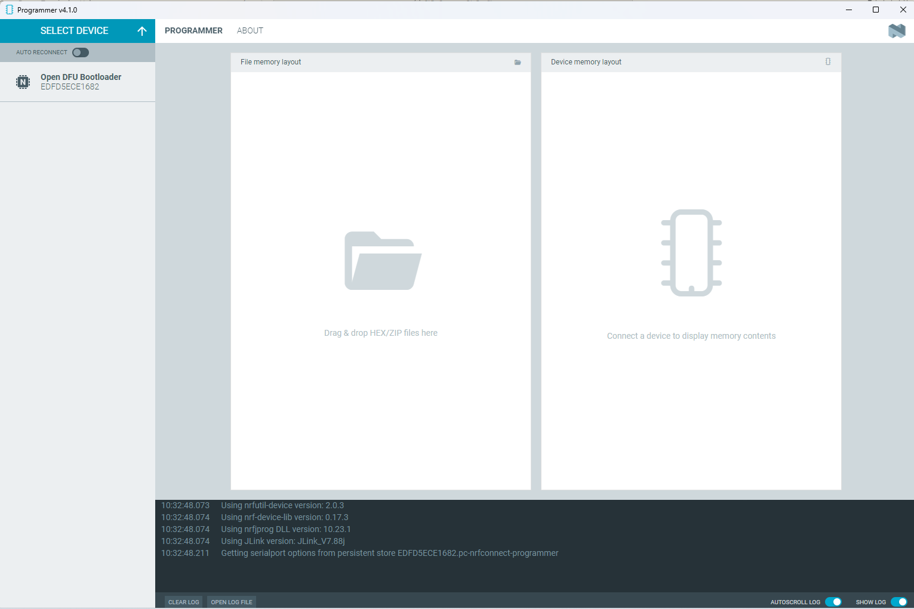
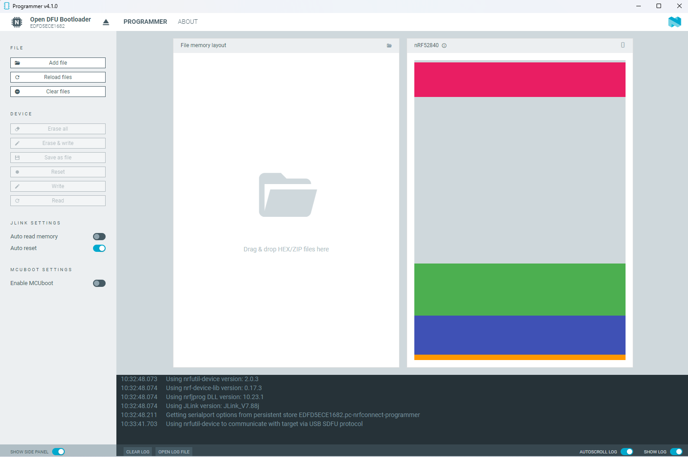
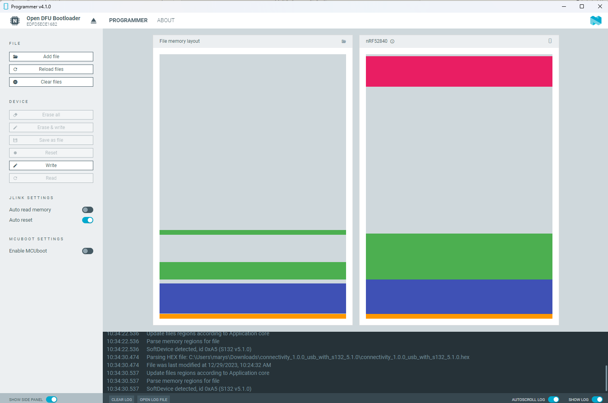

# Duke Project Example - Connect IQ App
> [!WARNING]
> Be sure to complete the [nRF_CustomBleProfile guide](https://github.com/4djelliot/nRF_CustomBleProfile) prior to cloning this repo, since we recommend cloning this repo into a new _DukeSampleApp_ folder in your Connect IQ SDK's _samples_ folder.

## Install the Garmin Monkey C Extension
* **Name**: Monkey C
* **Id**: Garmin.monkey-c
* **Description**: Monkey C Language Support
* **Version**: 1.0.10
* **Publisher**: Garmin
* **VS Marketplace Link**: https://marketplace.visualstudio.com/items?itemName=garmin.monkey-c


Once you open the CIQ project in Studio Code, you may encounter errors when trying to execute Monkey C commands such as:
```
Workspace not found.
Connect IQ project not found. Be sure your project has a monkey.jungle file and the project's Jungle Files setting is correct.
```

If so, use **File** -> **Add Folder** to Workspace and select the _DukeSampleApp_ folder.
Reference:
https://forums.garmin.com/developer/connect-iq/f/discussion/285079/can-t-build-or-debug-vscode-project


## BLE in the Connect IQ Simulator
Connect IQ supports BLE connectivity from within its simulator via a second dev-kit or nRF USB Dongle. This makes debugging much easier than debugging on watch hardware, as it allows you to use breakpoints in your Connect IQ code and avoid constantly flashing to hardware. Most of our work was done using the nRF USB Dongle, since you can leave the dongle attached to your PC even when re-programming the dev-kit. Follow the instructions below to flash the appropriate firmware to the nRF USB Dongle (see the [Connect IQ BLE Developer's Guide](https://developer.garmin.com/connect-iq/core-topics/bluetooth-low-energy/) for more information).

1. Download the [nRF USB Dongle firmware for Connect IQ connectivity](https://developer.garmin.com/downloads/connect-iq/connectivity_1.0.0_usb_with_s132_5.1.0.zip). Extract the hex file from the downloaded zip file.
2. Plug the nRF USB Dongle into your computer. If you have not previously programmed the dongle, it should enter the Bootloader state, indicated by a flashing red LED on the unit. It will not enumerate to a drive on your computer - this is expected.
3. Open nRF Connect for Desktop -> Programmer
4. Select "Select Device" and select the DFU bootloader from the dropdown.

5. Observe the memory layout for the dongle populate in the right side of the app.

6. Select "Add file" and select the hex file you downloaded in step 1. Observe the memory layout populate in the left side of the app.

7. Select "Write". You should see a pop-up appear to indicate the programming is in process. Once this completes, your nRF USB Dongle is programmed and ready to communicate.